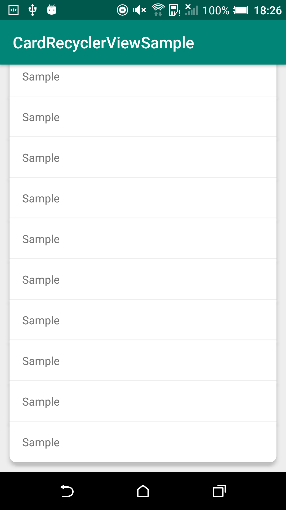

# CardRecyclerViewSample

`RecyclerView` の要素全体をひとつのカードに見立てたデザインを実現するサンプル実装。`ItemDecoration` を利用して実現した。  

境界線の描画については `elevation` の指定によるドロップシャドウが被ってしまい正しい色を表現できないので、`androidx.recyclerview.widget.DividerItemDecoration` は使わずに背景リソースに入れ込んでしまった。  
そのため境界線の高さ分のずれが生じる問題が残っている。

　
